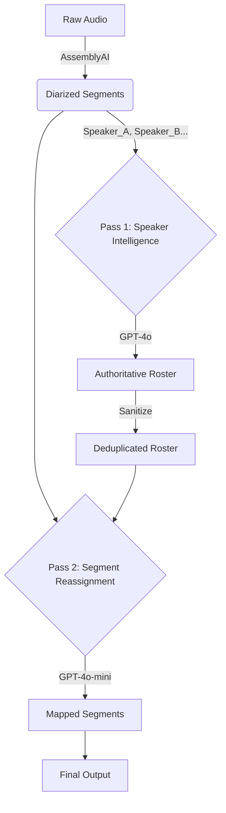

# Speaker Name & Role Assignment Pipeline

## 1. High-Level Architecture

The system uses a **Two-Pass "Authoritative Source" Architecture** to transform raw diarized audio segments into richly attributed, named speakers with roles.

**Core Philosophy:**
1.  **Pass 1 (Authority):** Use a high-intelligence model (GPT-4o) to determine *who* is in the file (the "Roster") based on context, names, and roles. This is the **Single Source of Truth**.
2.  **Pass 2 (Mapping):** Use a cost-efficient model (GPT-4o-mini) to map the raw diarization IDs (e.g., "Speaker_A") to the Authoritative Roster IDs (e.g., "speaker_1").



---

## 2. Input Data

**Source:** AssemblyAI Diarization
**Format:** Array of `SpeakerSegment`

```typescript
interface SpeakerSegment {
  speakerId: string; // "Speaker_A", "Speaker_B"
  startTime: number; // Seconds
  endTime: number;   // Seconds
  text: string;      // Transcript text
  confidence: number;// 0.0 - 1.0
}
```

---

## 3. Pass 1: Speaker Intelligence (The Authority)

**Goal:** Identify unique human speakers, assign roles, and reject false positives (locations, networks).
**Model:** `gpt-4o`
**Temperature:** `0.0` (Strict Determinism)

### 3.1 Input Context Construction
The system builds a "compact transcript" of the first `N` (default 150) utterances to send to GPT-4o.
- **Format:** `[index] Speaker_ID (Timestamp): Text`
- **Grouping:** Consecutive segments by the same speaker are merged to reduce token usage.

### 3.2 Prompts

**System Prompt:**
```text
You are a strict information extraction system.
You must not guess, infer, or use outside knowledge.
If something is not explicitly supported, return 'unknown'.
Output valid JSON only.
```

**User Prompt Template:**
```text
You are given a podcast transcript.

CONTEXT METADATA:
- Filename: "{{FILENAME}}"
- Hint: The filename often contains the names of the Guest or Host (e.g. "with Sam Harris"). Use this to identify speakers if they are not explicitly introduced in the text.

TASK:
Identify the unique HUMAN speakers in the transcript.

CRITICAL RULES:
1. IGNORE AD READS: Many audio files start with 1-2 minutes of Advertisements or Sponsor Reads. Do NOT include speakers who ONLY appear in the first 2 minutes reading an ad (unless they are the main host). Focus on identifying the Main Participants.
2. Only humans may be speakers
3. Locations, shows, networks, states are NEVER speakers (e.g., "New York", "NBC", "Pod Save America" are NOT speakers)
4. Ads → advertiser
5. Clips/montages → quoted_audio
6. One human = one speaker ID (consolidate if same person mentioned differently)
7. If uncertain, prefer fewer speakers over more
8. If you cannot identify a name, set name to null

ALLOWED ROLES (strict enum):
- host
- co_host
- guest
- narrator
- advertiser
- quoted_audio
- unknown

OUTPUT (JSON ONLY):
{
  "speakers": [
    {
      "id": "speaker_1",
      "name": "Full Name or null",
      "role": "host|co_host|guest|narrator|advertiser|quoted_audio|unknown",
      "confidence": 0.0-1.0
    }
  ]
}

TRANSCRIPT:
{{UTTERANCES}}

Return ONLY the JSON object. No explanations.
```

### 3.3 Validation Logic (Post-Generation)
The system runs strict regex checks against the GPT output to catch hallucinations:
- **Locations:** `/\b(new york|new jersey|los angeles|boston|chicago...)\b/i`
- **Networks:** `/\b(nbc|cnn|fox news|bbc|npr|msnbc...)\b/i`
- **Shows:** `/\b(pod save america|the daily show...)\b/i`
- **Venues:** `/\b(leicester square|madison square...)\b/i`

If a "Name" matches these patterns, it is flagged as an invalid speaker.

---

## 4. Intermediate Step: Roster Sanitization (Force-Merge)

**Goal:** Ensure we don't have duplicate entries for the same person (e.g., "Alice" and "Alice Fraser").
**Logic:** `lib/speaker-intelligence.ts` -> `sanitizeRoster`

1.  **Deduplication:** Uses Levenshtein distance to check for name similarities.
2.  **Force-Merge Loop:** If a `targetCount` (number of speakers) is provided by the API:
    -   Iteratively merges the "closest" pair of speakers (by name similarity or role/context).
    -   Repeats until the roster size matches the `targetCount`.
    -   **Constraint:** Never merges distinct roles (e.g., won't merge "Host" with "Advertiser") unless highly similar.

---

## 5. Pass 2: Segment Reassignment (The Mapper)

**Goal:** Map the original `Speaker_A` IDs to the authoritative `speaker_1` IDs from Pass 1.
**Model:** `gpt-4o-mini` (Cost optimized)
**Temperature:** `0.2`

### 5.1 Context Construction
- **GPT Speaker List:** The sanitized list from Pass 1 (ID, Name, Role).
- **Transcript:** A chunk of the transcript using the *original* AssemblyAI IDs.

### 5.2 Prompts

**System Prompt:**
```text
You are a transcript segment reassignment system.

YOUR ONLY JOB:
Map AssemblyAI speaker IDs to the correct GPT speaker IDs.

CRITICAL - YOU MUST USE SPEAKER IDS, NOT NAMES:
- ✓ CORRECT: "speaker_1", "speaker_2", "speaker_3", etc.
- ✗ WRONG: "Jessica Tarlov", "Jake Sullivan", "quoted_audio", etc.
- ALWAYS use the ID format "speaker_N" from the GPT speaker list
- NEVER use the person's name or role as the ID

STRICT RULES:
1. You MAY ONLY use speaker IDs from the provided GPT speaker list
2. Speaker IDs follow the format: speaker_1, speaker_2, speaker_3, etc.
3. You MAY NOT use speaker names (like "Jessica Tarlov") as IDs
4. You MAY NOT use role names (like "advertiser" or "quoted_audio") as IDs
5. Every AssemblyAI speaker MUST map to exactly ONE GPT speaker ID

DECISION CRITERIA:
- Conversational continuity (who logically speaks next?)
- Question/answer flow (questions usually followed by answers)
- Introduction patterns ("joined by X" → next speaker is X)
- Content type (ads → advertiser role, clips → quoted_audio role)

OUTPUT FORMAT (JSON ONLY):
{
  "mappings": {
    "Speaker_A": "speaker_1",
    "Speaker_B": "speaker_2",
    "Speaker_C": "speaker_3"
  }
}
```

**User Prompt:**
```text
Map each AssemblyAI speaker ID to the correct GPT speaker ID.

GPT SPEAKER LIST (use the IDs on the left, NOT the names):
{{GPT_SPEAKER_CONTEXT}}

IMPORTANT EXAMPLES:
✓ If Jessica Tarlov is speaker_2, use "speaker_2" (NOT "Jessica Tarlov")
✓ If advertiser is speaker_1, use "speaker_1" (NOT "advertiser")
✓ If quoted_audio is speaker_6, use "speaker_6" (NOT "quoted_audio")

TRANSCRIPT:
{{TRANSCRIPT_CONTEXT}}

Return ONLY the JSON mapping object using speaker IDs (speaker_1, speaker_2, etc.).
```

### 5.3 Validation & Application
1.  **Strict ID Check:** Every mapped ID *must* exist in the Authoritative Roster. If `gpt-4o-mini` hallucinates a new ID (e.g., `speaker_99`), it is flagged.
2.  **Application:** The system iterates through all segments.
    -   `Segment.speakerId` is replaced with the mapped `GPTSpeakerId`.
    -   If mapping is invalid/missing, it falls back to the original ID or marks confidence as low.

---

## 6. Heuristic Fallbacks

**Goal:** Fill in gaps where AI might return "Unknown" but context exists elsewhere.

### 6.1 Filename Priming
If a speaker is labeled "Unknown" or generic, the system checks the **Filename**.
-   **Regex:** Checks for patterns like `with [Name]`, `feat [Name]`, `[Name] Interview`.
-   **Logic:**
    -   Calculates speaker activity (segment counts).
    -   Assumes the **2nd most active speaker** is the Guest (Host is usually #1).
    -   If the 2nd speaker is named "Unknown", it assigns the extracted filename name to them.

---

## 7. Final Output Structure

The pipeline returns a unified object compatible with the legacy UI but powered by the new engine.

```typescript
{
  // The Authoritative List
  speakers: [
    { id: "speaker_1", name: "Lucas", role: "host", confidence: 0.95 },
    { id: "speaker_2", name: "Sam Harris", role: "guest", confidence: 0.92 }
  ],

  // The Reassigned Transcript
  segments: [
    { speakerId: "speaker_1", text: "Welcome...", startTime: 0, ... },
    { speakerId: "speaker_2", text: "Thanks...", startTime: 5, ... }
  ],

  // Diagnostics for Debugging
  diagnostics: {
    originalSpeakerCount: 5, // AssemblyAI saw 5
    finalSpeakerCount: 2,    // GPT consolidated to 2
    mappings: {
      "Speaker_A": "speaker_1",
      "Speaker_B": "speaker_1", // Merge!
      "Speaker_C": "speaker_2"
    }
  }
}
```
